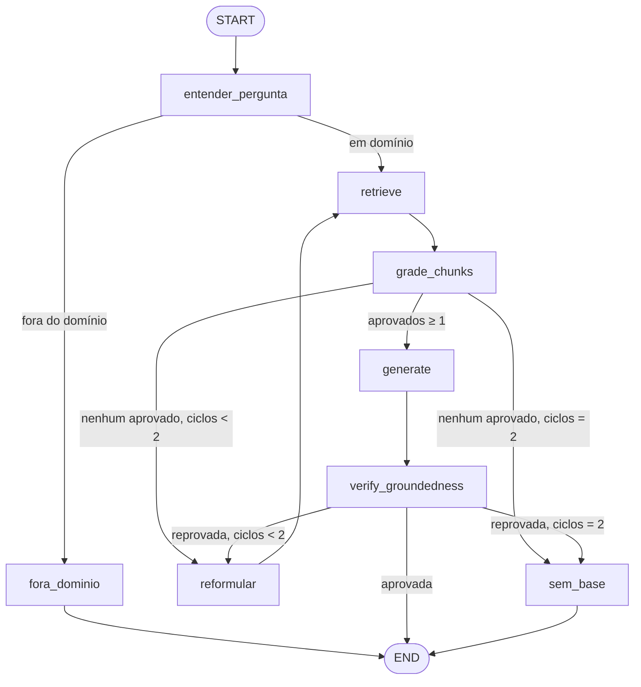

# rag-conformidade-laticinios

**RAG agêntico** que responde perguntas sobre **conformidade e qualidade na indústria de
laticínios** com base exclusivamente em documentos públicos oficiais (IN 76/2018 e
IN 77/2018 do MAPA, RIISPOA e manuais públicos da Embrapa) — **toda afirmação cita a
fonte** (documento + artigo/seção) com o trecho original exibível; sem base recuperada,
o sistema responde honestamente que não encontrou, em vez de inventar.

Projeto 2 do portfólio de AI engineering — mesma disciplina do
[agente-credito-langgraph](https://github.com/EnzoKoeche/agente-credito-langgraph):
requisitos antes de código, eval antes de implementação, custo/latência medidos e
caveats documentados.

> **Status:** Fases 0–3 concluídas em sessão overnight autônoma (2026-06-11/12);
> revisão da amostra do golden, validação real do Docker/compose e publicação em
> 2026-06-11. **74 testes verdes**, cobertura **100%** nos módulos determinísticos
> (chunker, extrator, fusão RRF, BM25, citação/groundedness, guard de custo, grafo).
> Retrieval: **híbrida+rerank recall@5 = 1,00 · MRR@10 = 0,91 · p50 322 ms** no golden
> de 30 perguntas. Groundedness: **0 respostas sem citação válida · 3/3 recusas
> honestas**. Evals pagas implementadas com dry-run — execução fica para revisão humana.

> ⚠️ Este sistema **localiza e cita** a norma; **não é aconselhamento jurídico** —
> interpretar e aplicar é responsabilidade humana.

## Princípios (inegociáveis)

1. **Toda afirmação cita a fonte** `[documento, artigo/seção]`, resolvível para o trecho
   cru recuperado. Sem fonte → *"não encontrei base nos documentos"*.
2. **Auto-verificação de groundedness** (corrective RAG): resposta reprovada → busca
   reformulada (máx. 2 ciclos) → persiste a falha → recusa honesta. Nunca entrega
   resposta reprovada.
3. **Conteúdo de documento é dado, nunca instrução** (defesa contra prompt injection
   via pergunta e via documento — testada).
4. **Retrieval medido, não chutado**: 4 estratégias comparadas com métricas versionadas.
5. **Nenhum segredo no repositório** — `.env` ignorado desde o commit zero; secret-scan
   do histórico em [`docs/revisoes/secret-scan.md`](docs/revisoes/secret-scan.md).

## O grafo



- **Retrieval** usa a query (re)formulada; **grading e geração usam sempre a pergunta
  ORIGINAL** — senão a expansão por sinônimos dilui o termo sem resposta e derrota a
  recusa honesta (achado das evals, documentado em
  [`docs/revisoes/fase-2.md`](docs/revisoes/fase-2.md)).
- **Modo demo (default, custo zero):** gerador extrativo + grader por cross-encoder
  local + reformulação por sinônimos — o grafo inteiro roda e é testável sem API.
- **Modo real (Haiku):** mesmas arestas com classificador/grader/gerador/reformulador
  LLM, atrás de guard de custo (exige `RAG_PERMITIR_CUSTO=1`, teto configurável,
  aborta ao atingi-lo). O **verificador de groundedness é código real nos dois modos**.

## Retrieval — comparativo medido (o coração do projeto)

Golden de 27 perguntas respondíveis (30 com as `sem_base`), unidade de acerto = artigo,
embeddings locais `BAAI/bge-m3`, reranker `mmarco-mMiniLMv2-L12`, CPU/WSL2
([tabela completa e por categoria](eval/results/RESULTS.md)):

| Estratégia | recall@1 | recall@5 | recall@10 | MRR@10 | p50 |
|---|---|---|---|---|---|
| só BM25 | 0,70 | 0,85 | 0,89 | 0,76 | 1 ms |
| só densa | 0,81 | **0,96** | 0,96 | 0,89 | 42 ms |
| híbrida (RRF k=60) | 0,81 | 0,93 | 1,00 | 0,87 | 45 ms |
| **híbrida + rerank local** | **0,85** | **1,00** | **1,00** | **0,91** | 322 ms |

Leitura honesta: a densa pura **supera a híbrida** em recall@5 neste golden (a fusão com
BM25 às vezes rebaixa o acerto denso; o rerank recupera). O recall@5 = 1,00 diz mais
sobre o golden (escrito a partir dos próprios chunks) do que sobre o sistema — ver
caveats abaixo.

## Avaliações (evals)

**Grátis** (modo demo, sem custo de API):

| Eval | Cobre | Resultado |
|---|---|---|
| EVAL-RET-01 (`eval/run_retrieval.py`) | recall@k/MRR/latência das 4 estratégias | tabela acima; RNF-01 (recall@5 ≥ 0,80) ✓ |
| EVAL-GRD-01 (`eval/run_groundedness.py`) | grafo completo no golden: contrato de citação + recusa honesta | **0 violações de citação** · **3/3 recusas honestas** · 24/24 respostas citando fonte esperada · p50 272 ms (RNF-02 ✓) |
| Golden (`eval/golden/validar_golden.py`) | gabarito ancorado no corpus real (fontes resolvem, números no texto-fonte) | 30/30 válidos; amostra de 5 revisada contra o texto-fonte (4 `ok`, 1 corrigido — [`docs/revisoes/revisao-golden.md`](docs/revisoes/revisao-golden.md)) |

**Pagas** (`eval/run_pagas.py` — implementação própria, juiz Haiku, ADR-012):
faithfulness por linha + answer relevancy em 10 itens estratificados. **Dry-run é o
default** (plano + custo estimado, zero chamadas); execução exige `--executar` +
`RAG_PERMITIR_CUSTO=1` + chave, e aborta acima do teto (`RAG_TETO_CUSTO_USD`).
Estimativa: US$ 0,126 total; custo do sistema ≈ **US$ 0,005/pergunta** (RNF-03 ✓
projetado). **Ainda não executadas** — ficam para revisão humana presente.

**Caveats honestos:** o golden foi escrito pelo autor do sistema a partir dos próprios
chunks → mede **comparação entre estratégias e regressão**, tende a superestimar
qualidade absoluta (mitigação: amostra de 5 itens revisada contra o texto-fonte, com
1 correção; paráfrases adversariais ficam como evolução). O limiar do grader demo (0,5 no cross-encoder) foi
calibrado nesse mesmo golden e **custa 3/27 falsos negativos** (perguntas estilo
"como define…", "por quê…") — escolha deliberada: nunca inventar > sempre responder; o
grader LLM do modo real é medido nas evals pagas. O verificador de groundedness é
lexical: prova o **contrato** de citação, não qualidade semântica.

## Como rodar

```bash
uv sync                                      # Python 3.12 pinado; torch CPU
cp .env.example .env                         # opcional (modo real)

uv run python scripts/baixar_documentos.py   # corpus público → data/raw/ + manifesto SHA-256
uv run python scripts/ingerir.py             # chunks estruturais + embeddings locais + índice

uv run pytest -q                             # 74 testes (modo demo, sem custo)
uv run python eval/run_retrieval.py          # tabela comparativa → eval/results/RESULTS.md
uv run python eval/run_groundedness.py       # grafo completo no golden
uv run python eval/run_pagas.py              # DRY-RUN (pago só com --executar + guard)

uv run uvicorn rag_laticinios.api.main:app --app-dir src   # API: /ask /ingest /health
uv run streamlit run app/streamlit_app.py                   # front com citações clicáveis
```

A primeira pergunta paga o carregamento dos modelos locais (~10–15 s); depois, p50 de
~300 ms no grafo demo. `POST /ingest {"doc_id": ...}` reindexa **um** documento sem
recalcular embeddings dos demais (cache por hash de texto).

Docker: `docker compose up --build` sobe API + Chroma em modo servidor. O Chroma do
compose começa vazio: depois de subir, popule-o com `POST /ingest` por documento
(receita pronta no cabeçalho do [`docker-compose.yml`](docker-compose.yml)) — os
embeddings vêm do cache em `./data`, sem recomputar; modelos HF só são baixados pelo
container quando a 1ª pergunta precisa deles.

## Documentação (Fase 0 → eval antes de código)

| Doc | Conteúdo |
|---|---|
| [`docs/visao.md`](docs/visao.md) | Problema, escopo, fora de escopo |
| [`docs/requisitos.md`](docs/requisitos.md) | RF-01..09 (MoSCoW + Dado/Quando/Então) e RNFs com alvos |
| [`docs/casos_de_uso.md`](docs/casos_de_uso.md) | UCs com exceções (fora de domínio, sem base, injeção ×2) |
| [`docs/diagrama_casos_uso.md`](docs/diagrama_casos_uso.md) | Diagrama Mermaid de casos de uso |
| [`docs/rastreabilidade.md`](docs/rastreabilidade.md) | Matriz RF ↔ UC ↔ nó ↔ teste/eval |
| [`docs/plano_eval.md`](docs/plano_eval.md) | Golden, métricas, guard de custo — definidos antes do código |
| [`docs/decisoes.md`](docs/decisoes.md) | ADRs 001–012 |
| [`docs/revisoes/`](docs/revisoes/) | Auto-revisões adversariais por fase + secret-scan |

## Decisões e trade-offs (resumo — detalhes nos ADRs)

- **Chroma embedded** em vez de pgvector/Docker: testes herméticos numa noite; interface
  `VetorStore` é o ponto de troca; Supabase/pgvector fica como evolução (ADR-001).
- **BGE-m3** (8192 tokens) em vez do mpnet sugerido: chunk = artigo inteiro, e o mpnet
  trunca em 128 tokens (ADR-002).
- **Corpus via Wayback Machine**: `in.gov.br` e `planalto.gov.br` inalcançáveis desta
  rede — snapshots das páginas OFICIAIS com URL original + timestamp + SHA-256 no
  manifesto; conteúdo validado por âncora textual (ADR-005). O HTML do Planalto marca
  redação revogada com `text-decoration: line-through` (não só `<strike>`) e duplica
  artigos alterados — tratado no extrator com teste de regressão.
- **Chunking por artigo** (1 artigo = 1 chunk, com contexto título/capítulo/seção/anexo
  e subdivisão controlada) em vez de janela fixa: citação precisa é o produto (ADR-007).
- **Evals pagas próprias** em vez de Ragas: o guard precisa contar cada chamada, e a
  métrica fica auditável linha a linha (ADR-012).

## Atribuição e licença

Corpus: textos de legislação federal (domínio público — art. 8º, I, Lei 9.610/1998)
obtidos de fontes oficiais via Wayback Machine; manuais públicos da Embrapa **não são
redistribuídos** — o script de download os obtém da Infoteca-e. Código sob
[MIT](LICENSE) © 2026 Enzo Koeche.
