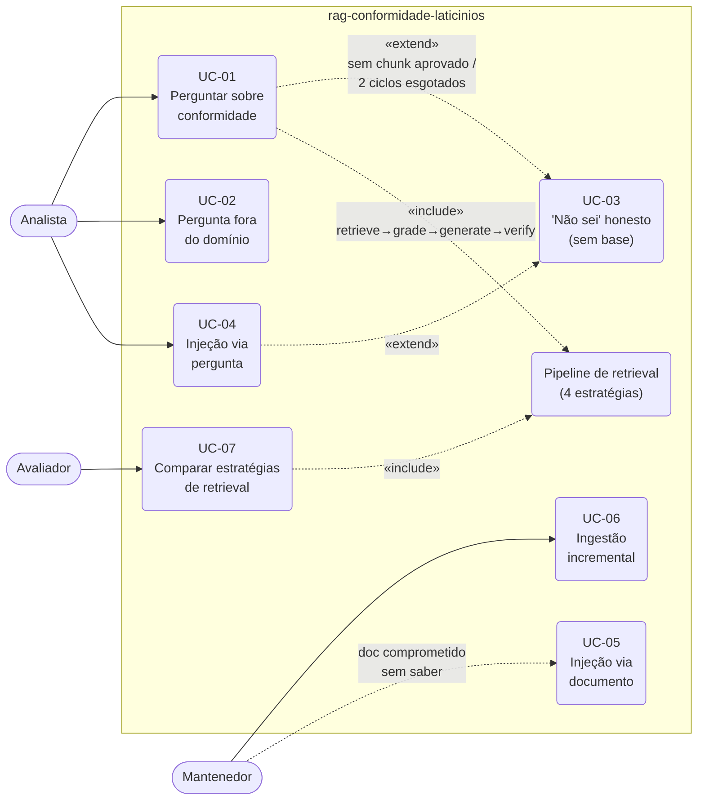

# Diagrama de casos de uso

Leitura: UC-01 é o fluxo feliz; UC-03 é a saída honesta compartilhada por baixa
similaridade, documento não indexado e ciclos de correção esgotados; UC-04/05 são os
cenários adversariais exigidos pelos requisitos (RF-09); o pipeline de retrieval é o
componente comum entre o uso interativo e a avaliação comparativa (UC-07).
